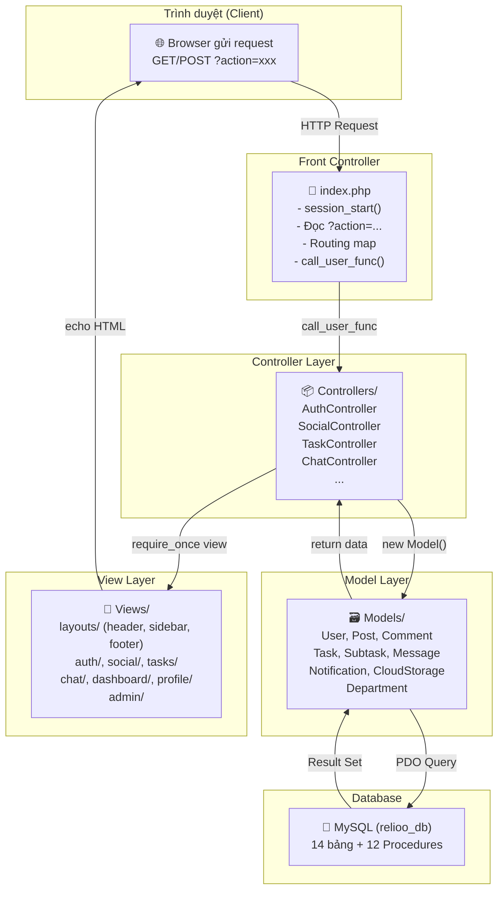
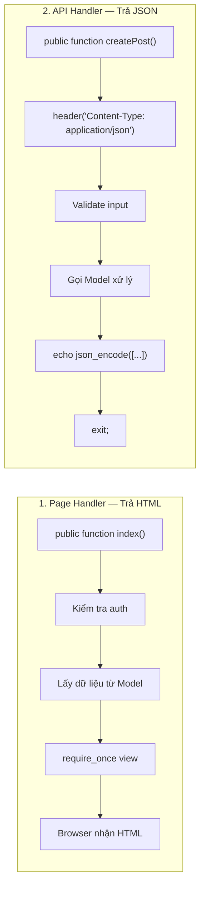
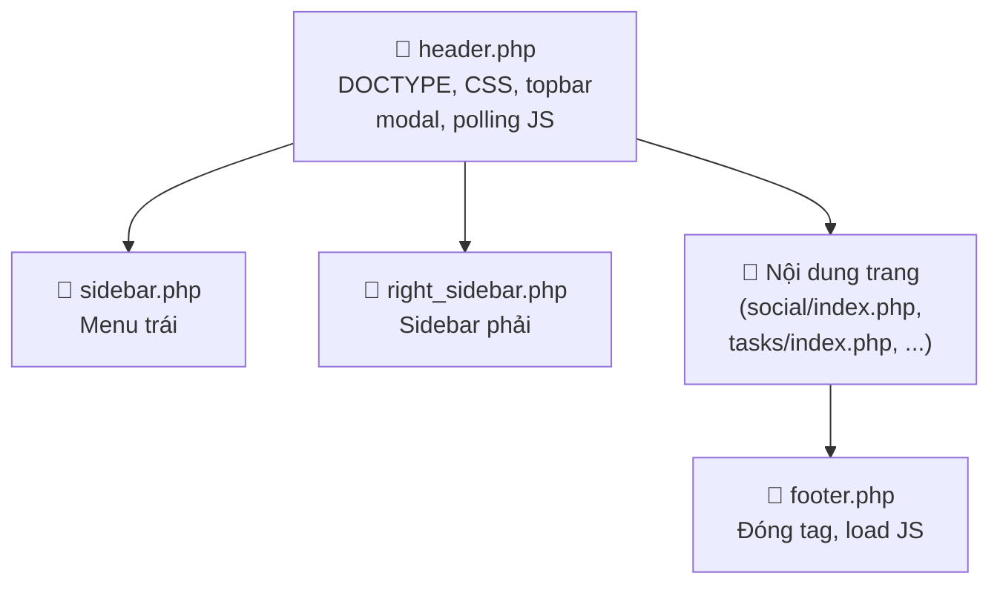
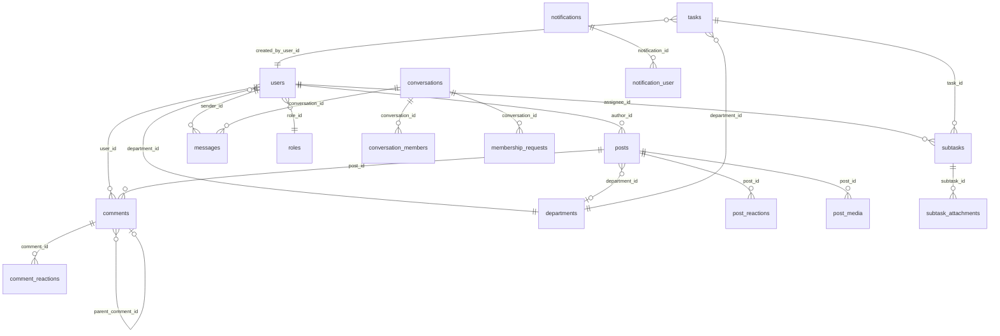
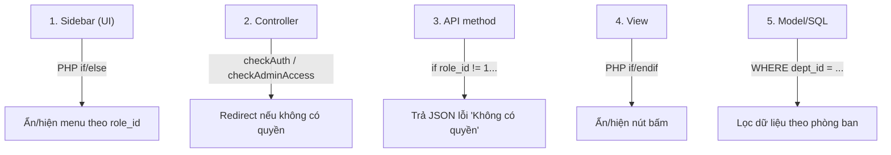
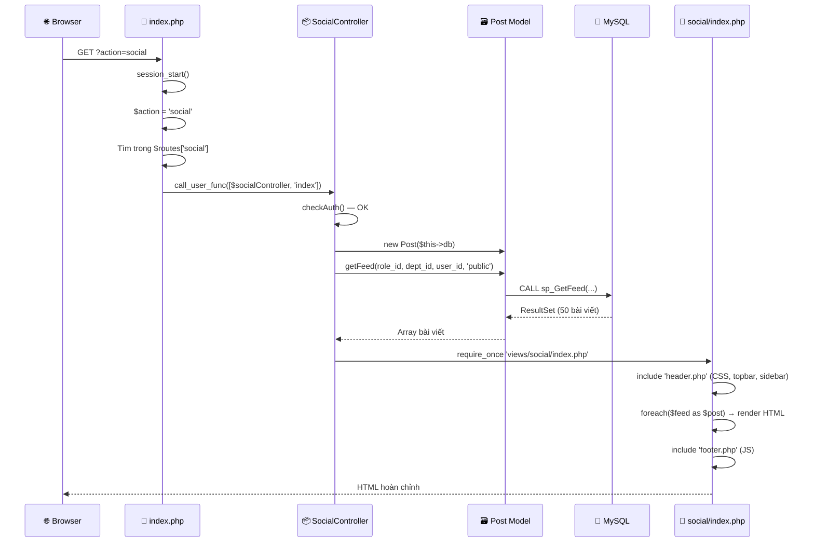
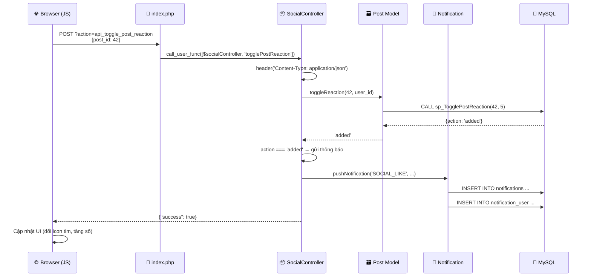
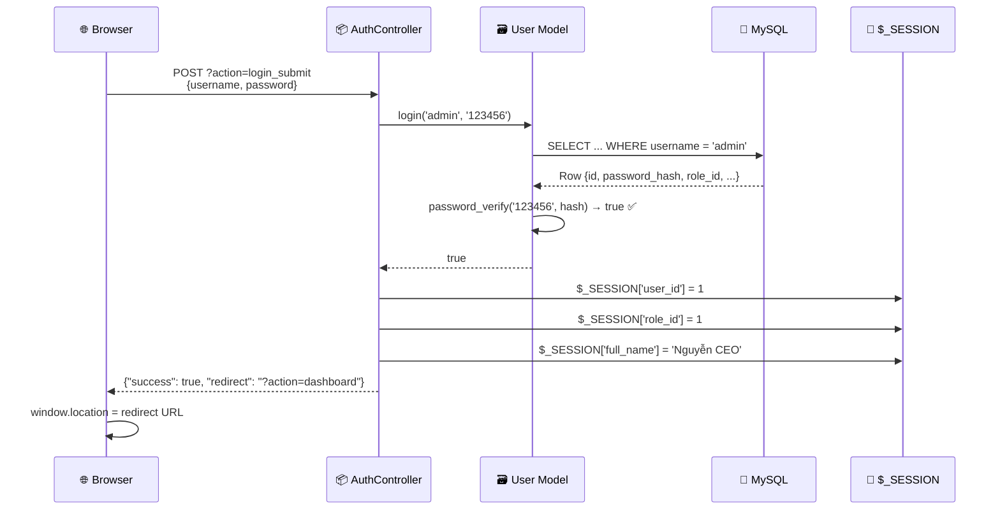
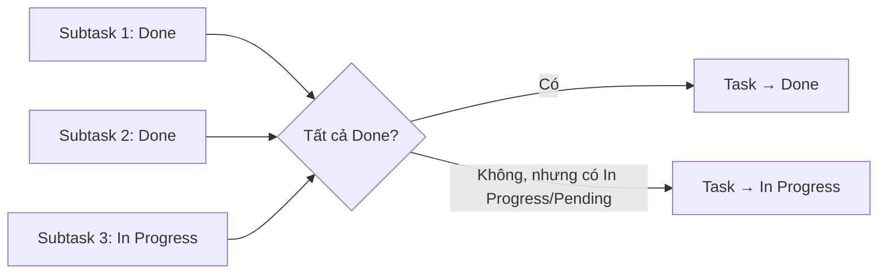
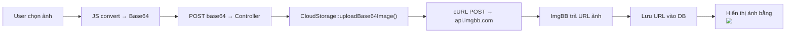

# 📚 Hướng Dẫn Toàn Diện Source Code — Relioo Enterprise Social Network

> **Mục tiêu**: Sau khi đọc xong tài liệu này, bạn sẽ **nắm rõ từng thư mục, từng file, từng loại dòng code**, hiểu cách chúng kết nối với nhau, và có thể tự tin giải thích hoặc chỉnh sửa bất kỳ phần nào của dự án.

---

## 📑 Mục Lục

1. [Tổng quan kiến trúc](#1-tổng-quan-kiến-trúc)
2. [Cây thư mục — Giải thích từng file](#2-cây-thư-mục--giải-thích-từng-file)
3. [Tầng Config — Cấu hình & Kết nối](#3-tầng-config--cấu-hình--kết-nối)
4. [Tầng Models — Truy vấn CSDL](#4-tầng-models--truy-vấn-csdl)
5. [Tầng Controllers — Xử lý nghiệp vụ](#5-tầng-controllers--xử-lý-nghiệp-vụ)
6. [Tầng Views — Giao diện HTML](#6-tầng-views--giao-diện-html)
7. [Bảng Routes — Bản đồ điều hướng](#7-bảng-routes--bản-đồ-điều-hướng)
8. [Cơ sở dữ liệu — Bảng & Stored Procedures](#8-cơ-sở-dữ-liệu--bảng--stored-procedures)
9. [Hệ thống phân quyền RBAC](#9-hệ-thống-phân-quyền-rbac)
10. [Luồng xử lý Request (Lifecycle)](#10-luồng-xử-lý-request-lifecycle)
11. [Kỹ thuật nâng cao & Design Patterns](#11-kỹ-thuật-nâng-cao--design-patterns)
12. [Bảng tổng kết các loại dòng code](#12-bảng-tổng-kết-các-loại-dòng-code)

---

## 1. Tổng Quan Kiến Trúc

Dự án sử dụng kiến trúc **MVC thuần PHP** (Model – View – Controller) kết hợp với **Front Controller Pattern**.



> [!IMPORTANT]
> **Tất cả request đều đi qua `index.php`**. Không có file PHP nào khác được truy cập trực tiếp từ URL. Đây là ý nghĩa của "Front Controller Pattern".

### Công nghệ sử dụng

| Thành phần | Công nghệ |
|---|---|
| **Backend** | PHP 8.x thuần (không framework) |
| **Database** | MySQL 8.x + Stored Procedures |
| **ORM** | Không dùng — truy vấn bằng PDO trực tiếp |
| **Frontend** | HTML5 + Bootstrap 5 + jQuery 3.7 |
| **CSS** | Bootstrap 5 CDN + `style.css` custom |
| **JS Libraries** | Toastr (toast), SweetAlert2 (dialog), Chart.js (biểu đồ) |
| **Cloud Storage** | ImgBB API (upload ảnh) |
| **AI** | Groq API (LLaMA 3.3 70B) — tạo báo cáo tự động |
| **Networking** | Tailscale VPN (kết nối DB qua LAN ảo) |

---

## 2. Cây Thư Mục — Giải Thích Từng File

```
📦 Nhom9-WebDev-EnterpriseSocialNetwork-Project/
│
├── 📄 index.php                    ← 🌟 ENTRY POINT — Bộ não định tuyến
├── 📄 .env                         ← Biến môi trường (DB host, API key)
├── 📄 .gitignore                   ← Danh sách file Git bỏ qua
├── 📄 generate_mock_data.php       ← Script tạo dữ liệu mẫu
├── 📄 README.md                    ← Tài liệu dự án
│
├── 📁 config/
│   └── 📄 database.php             ← Class Database — kết nối MySQL qua PDO
│
├── 📁 controllers/                  ← Tầng xử lý nghiệp vụ (Business Logic)
│   ├── 📄 AuthController.php       ← Đăng nhập / Đăng xuất
│   ├── 📄 DashboardController.php  ← Trang tổng quan thống kê
│   ├── 📄 AdminController.php      ← Quản trị nhân sự & phòng ban
│   ├── 📄 SocialController.php     ← Bảng tin: bài viết, bình luận, like
│   ├── 📄 TaskController.php       ← Quản lý task/subtask (LỚN NHẤT ~1073 dòng)
│   ├── 📄 ChatController.php       ← Tin nhắn cá nhân & nhóm
│   ├── 📄 NotificationController.php ← Thông báo realtime (polling)
│   └── 📄 ProfileController.php    ← Trang cá nhân, cập nhật hồ sơ
│
├── 📁 models/                       ← Tầng truy vấn CSDL (Data Access)
│   ├── 📄 User.php                 ← CRUD người dùng, login, profile
│   ├── 📄 Post.php                 ← CRUD bài viết, reaction, feed
│   ├── 📄 Comment.php              ← CRUD bình luận, phân cấp cha-con
│   ├── 📄 Task.php                 ← CRUD Task (dự án), thống kê
│   ├── 📄 Subtask.php              ← CRUD Subtask, evidence, KPI
│   ├── 📄 Message.php              ← Tin nhắn, hội thoại, nhóm chat
│   ├── 📄 Notification.php         ← Tạo/đọc thông báo, chống trùng
│   ├── 📄 CloudStorage.php         ← Upload ảnh lên ImgBB (cloud)
│   └── 📄 Department.php           ← Danh sách phòng ban
│
├── 📁 views/                        ← Tầng giao diện HTML/PHP
│   ├── 📁 layouts/                  ← Khung bao chung cho mọi trang
│   │   ├── 📄 header.php           ← DOCTYPE, CSS, topbar, modal, JS polling
│   │   ├── 📄 sidebar.php          ← Thanh điều hướng bên trái
│   │   ├── 📄 right_sidebar.php    ← Sidebar phải (leaderboard, v.v.)
│   │   └── 📄 footer.php           ← Đóng tag HTML, load Bootstrap JS + Chart.js
│   │
│   ├── 📁 auth/
│   │   └── 📄 login.php            ← Trang đăng nhập
│   ├── 📁 dashboard/
│   │   └── 📄 index.php            ← Dashboard thống kê (Chart.js)
│   ├── 📁 social/
│   │   └── 📄 index.php            ← Bảng tin nội bộ (feed, post, comment)
│   ├── 📁 tasks/
│   │   └── 📄 index.php            ← Quản lý công việc (Kanban board)
│   ├── 📁 chat/
│   │   └── 📄 index.php            ← Giao diện chat
│   ├── 📁 profile/
│   │   └── 📄 index.php            ← Trang cá nhân
│   └── 📁 admin/
│       ├── 📄 users.php            ← Danh sách nhân viên (Admin)
│       └── 📄 departments.php      ← Danh sách phòng ban (Admin)
│
├── 📁 public/
│   └── 📁 css/
│       └── 📄 style.css            ← CSS tuỳ chỉnh ghi đè Bootstrap
│
├── 📁 database/
│   ├── 📄 relioo_db.sql            ← Schema đầy đủ (CREATE TABLE, INSERT)
│   └── 📄 procedures.sql           ← 12 Stored Procedures
│
├── 📁 0.planning/                   ← Tài liệu kế hoạch dự án
└── 📁 1.DIAGRAM/                    ← Sơ đồ thiết kế
```

---

## 3. Tầng Config — Cấu Hình & Kết Nối

### 3.1. File `.env` — Biến môi trường

```env
DB_HOST=100.72.177.39        # IP máy chủ DB (qua Tailscale VPN)
DB_PORT=3306                  # Port MySQL mặc định
DB_DATABASE=relioo_db         # Tên database
DB_USERNAME=Nhom9             # User MySQL
DB_PASSWORD=123456            # Mật khẩu
GROQ_API_KEY=gsk_xxx...      # API Key cho AI (Groq/LLaMA)
```

### 3.2 File [database.php](file:///d:/Nhom9-WebDev-EnterpriseSocialNetwork-Project/config/database.php) — Class Database

| Dòng code | Loại | Giải thích |
|---|---|---|
| `class Database { ... }` | Khai báo class | Tạo class `Database` để quản lý kết nối |
| `public $conn;` | Thuộc tính | Biến lưu đối tượng PDO connection |
| `$lines = file(__DIR__.'/../.env', ...);` | Đọc file | Đọc file `.env` thành mảng dòng |
| `if (strpos(trim($line), '#') === 0) continue;` | Logic filter | Bỏ qua dòng comment bắt đầu bằng `#` |
| `$parts = explode('=', $line, 2);` | Parse chuỗi | Tách dòng thành `KEY=VALUE` |
| `$host = $env['DB_HOST'] ?? getenv('DB_HOST') ?: 'localhost';` | Fallback chain | Ưu tiên: file `.env` → biến hệ thống → giá trị mặc định |
| `new PDO($dsn, $user, $pass)` | Kết nối DB | Tạo kết nối MySQL qua PDO |
| `setAttribute(PDO::ATTR_ERRMODE, PDO::ERRMODE_EXCEPTION)` | Cấu hình PDO | Bật chế độ ném exception khi có lỗi SQL |
| `setAttribute(PDO::ATTR_DEFAULT_FETCH_MODE, PDO::FETCH_ASSOC)` | Cấu hình PDO | Mặc định trả kết quả dạng mảng key-value |

> [!TIP]
> **Chuỗi fallback** `$env['X'] ?? getenv('X') ?: 'default'` cho phép ứng dụng chạy cả trên máy cục bộ (XAMPP) lẫn server production (biến môi trường hệ thống).

---

## 4. Tầng Models — Truy Vấn CSDL

Mỗi Model tương ứng với 1 bảng (hoặc nhóm bảng) trong database. Model **chỉ chứa logic truy vấn**, không chứa logic nghiệp vụ.

### 4.1 Cấu trúc chung của một Model

```php
<?php
class Post {
    private $conn;                          // ← Lưu PDO connection
    public $table_name = "posts";           // ← Tên bảng trong DB

    public function __construct($db) {      // ← Nhận connection từ Controller
        $this->conn = $db;
    }

    public function create($author_id, ...) {
        $query = "INSERT INTO " . $this->table_name . " (...) VALUES (:author_id, ...)";
        $stmt = $this->conn->prepare($query);    // ← Prepared Statement
        $stmt->bindParam(":author_id", $author_id); // ← Gán tham số an toàn
        if($stmt->execute()) {                       // ← Thực thi
            return $this->conn->lastInsertId();      // ← Trả ID mới tạo
        }
        return false;
    }
}
```

### 4.2 Tổng quan 9 Models

| Model | File | Bảng chính | Số method | Chức năng chính |
|---|---|---|---|---|
| **User** | [User.php](file:///d:/Nhom9-WebDev-EnterpriseSocialNetwork-Project/models/User.php) | `users` | 4 | Login, lấy thông tin, cập nhật profile |
| **Post** | [Post.php](file:///d:/Nhom9-WebDev-EnterpriseSocialNetwork-Project/models/Post.php) | `posts` | 7 | CRUD bài viết, feed (Stored Procedure), reaction |
| **Comment** | [Comment.php](file:///d:/Nhom9-WebDev-EnterpriseSocialNetwork-Project/models/Comment.php) | `comments` | 7 | CRUD bình luận, phân cấp cha-con, reaction |
| **Task** | [Task.php](file:///d:/Nhom9-WebDev-EnterpriseSocialNetwork-Project/models/Task.php) | `tasks` | 8 | CRUD Task, thống kê dashboard, chống trùng |
| **Subtask** | [Subtask.php](file:///d:/Nhom9-WebDev-EnterpriseSocialNetwork-Project/models/Subtask.php) | `subtasks` | 14 | CRUD Subtask, evidence, đồng bộ Task cha, KPI |
| **Message** | [Message.php](file:///d:/Nhom9-WebDev-EnterpriseSocialNetwork-Project/models/Message.php) | `messages`, `conversations` | 12 | Gửi/nhận tin nhắn, nhóm chat, đã đọc |
| **Notification** | [Notification.php](file:///d:/Nhom9-WebDev-EnterpriseSocialNetwork-Project/models/Notification.php) | `notifications` | 7 | Tạo/đọc thông báo, broadcast, chống trùng |
| **CloudStorage** | [CloudStorage.php](file:///d:/Nhom9-WebDev-EnterpriseSocialNetwork-Project/models/CloudStorage.php) | *(không có bảng)* | 2 | Upload ảnh lên ImgBB cloud |
| **Department** | [Department.php](file:///d:/Nhom9-WebDev-EnterpriseSocialNetwork-Project/models/Department.php) | `departments` | 1 | Lấy danh sách phòng ban |

### 4.3 Các pattern quan trọng trong Models

#### Pattern 1: Prepared Statement (Chống SQL Injection)
```php
// ❌ KHÔNG AN TOÀN — dễ bị SQL Injection
$query = "SELECT * FROM users WHERE id = $id";

// ✅ AN TOÀN — sử dụng Prepared Statement
$query = "SELECT * FROM users WHERE id = :id";
$stmt = $this->conn->prepare($query);
$stmt->bindParam(':id', $id);
$stmt->execute();
```

#### Pattern 2: Gọi Stored Procedure
```php
$query = "CALL sp_GetFeed(:current_user, :role_id, :dept_id, :channel, :search)";
$stmt = $this->conn->prepare($query);
$stmt->bindParam(':current_user', $current_user_id);
// ... bind các tham số khác ...
$stmt->execute();
$stmt->closeCursor();  // ← BẮT BUỘC khi gọi procedure trả về result set
```

#### Pattern 3: Chống trùng lặp (Duplicate Prevention)
```php
// Kiểm tra xem đã tồn tại bản ghi giống hệt chưa
$checkQuery = "SELECT id FROM tasks WHERE title = :title AND status != 'Done'";
$checkStmt->execute([...]);
if ($row = $checkStmt->fetch(PDO::FETCH_ASSOC)) {
    return 'DUPLICATE';  // ← Trả chuỗi đặc biệt thay vì tạo mới
}
// Nếu không trùng → tiến hành INSERT
```

#### Pattern 4: Phân cấp Comment (Parent → Children)
```php
// Lấy tất cả comment → phân nhóm trong PHP
$all_comments = $stmt->fetchAll(PDO::FETCH_ASSOC);
$parents = [];
$children = [];
foreach ($all_comments as $c) {
    if ($c['parent_comment_id'] == NULL) {
        $parents[$c['id']] = $c;       // ← Comment gốc
        $parents[$c['id']]['replies'] = [];
    } else {
        $children[] = $c;               // ← Reply
    }
}
foreach ($children as $child) {
    $parents[$child['parent_comment_id']]['replies'][] = $child;
}
```

#### Pattern 5: Upload ảnh lên Cloud (ImgBB)
```php
// Sử dụng cURL gọi API ImgBB
$ch = curl_init();
curl_setopt($ch, CURLOPT_URL, 'https://api.imgbb.com/1/upload');
curl_setopt($ch, CURLOPT_POST, 1);
curl_setopt($ch, CURLOPT_POSTFIELDS, ['key' => $apiKey, 'image' => $base64Data]);
curl_setopt($ch, CURLOPT_RETURNTRANSFER, true);
$response = curl_exec($ch);
$result = json_decode($response, true);
return $result['data']['url'];  // ← Trả về URL ảnh đã upload
```

---

## 5. Tầng Controllers — Xử Lý Nghiệp Vụ

### 5.1 Cấu trúc chung của một Controller

```php
<?php
require_once __DIR__ . '/../config/database.php';  // ← Import Database
require_once __DIR__ . '/../models/Post.php';       // ← Import Model

class SocialController {
    private $db;                                     // ← Lưu PDO connection

    public function __construct() {
        $database = new Database();
        $this->db = $database->getConnection();      // ← Tạo kết nối 1 lần
    }

    // Method hiển thị trang (Page Handler)
    public function index() {
        if(!isset($_SESSION['user_id'])) {           // ← Kiểm tra đăng nhập
            header("Location: index.php?action=login");
            exit;
        }
        $pageTitle = "Bảng tin";                     // ← Biến cho header
        $postModel = new Post($this->db);            // ← Tạo Model
        $feed = $postModel->getFeed(...);            // ← Gọi Model lấy dữ liệu
        require_once __DIR__ . '/../views/social/index.php'; // ← Render view
    }

    // Method API (trả JSON)
    public function createPost() {
        header('Content-Type: application/json');    // ← Đánh dấu trả JSON
        // ... validate, xử lý ...
        echo json_encode(['success' => true]);       // ← Trả kết quả JSON
        exit;                                         // ← PHẢI exit sau echo
    }
}
```

### 5.2 Tổng quan 8 Controllers

| Controller | File | Số method | Vai trò |
|---|---|---|---|
| **AuthController** | [AuthController.php](file:///d:/Nhom9-WebDev-EnterpriseSocialNetwork-Project/controllers/AuthController.php) | 3 | `showLogin`, `login`, `logout` |
| **DashboardController** | [DashboardController.php](file:///d:/Nhom9-WebDev-EnterpriseSocialNetwork-Project/controllers/DashboardController.php) | 1 | `index` — thống kê theo role |
| **AdminController** | [AdminController.php](file:///d:/Nhom9-WebDev-EnterpriseSocialNetwork-Project/controllers/AdminController.php) | 3 | `users`, `departments` + `checkAdminAccess` |
| **SocialController** | [SocialController.php](file:///d:/Nhom9-WebDev-EnterpriseSocialNetwork-Project/controllers/SocialController.php) | 12 | CRUD bài viết, bình luận, reaction, tìm kiếm |
| **TaskController** | [TaskController.php](file:///d:/Nhom9-WebDev-EnterpriseSocialNetwork-Project/controllers/TaskController.php) | 16 | CRUD task/subtask, evidence, AI report, approve/reject |
| **ChatController** | [ChatController.php](file:///d:/Nhom9-WebDev-EnterpriseSocialNetwork-Project/controllers/ChatController.php) | 8 | Chat, gửi tin nhắn, nhóm, polling |
| **NotificationController** | [NotificationController.php](file:///d:/Nhom9-WebDev-EnterpriseSocialNetwork-Project/controllers/NotificationController.php) | 4 | Fetch, mark read, push (static helper) |
| **ProfileController** | [ProfileController.php](file:///d:/Nhom9-WebDev-EnterpriseSocialNetwork-Project/controllers/ProfileController.php) | 2 | `index` (xem profile), `updateProfile` |

### 5.3 Hai loại method trong Controller



| Loại | Khi nào dùng | Ví dụ route | Trả về |
|---|---|---|---|
| **Page Handler** | User truy cập trang | `?action=social` | HTML (cả trang) |
| **API Handler** | JavaScript gọi AJAX | `?action=api_create_post` | JSON `{success, message}` |

---

## 6. Tầng Views — Giao Diện HTML

### 6.1 Cấu trúc Layout (Khung trang)

Mỗi trang được "bọc" bởi 3 file layout:



Trong mỗi View page (`social/index.php`, `tasks/index.php`, ...), cấu trúc luôn là:

```php
<?php include __DIR__ . '/../layouts/header.php'; ?>

<!-- NỘI DUNG TRANG Ở ĐÂY -->
<div class="container-fluid">
    <!-- HTML + PHP echo dữ liệu -->
</div>

<!-- JAVASCRIPT CỦA TRANG -->
<script>
    // Logic AJAX, Kanban kéo thả, ...
</script>

<?php include __DIR__ . '/../layouts/footer.php'; ?>
```

### 6.2 Chi tiết [header.php](file:///d:/Nhom9-WebDev-EnterpriseSocialNetwork-Project/views/layouts/header.php) — File quan trọng nhất (~580 dòng)

| Khu vực | Dòng | Nội dung |
|---|---|---|
| **HTML Head** | 1–50 | `<head>` chứa CSS CDN (Bootstrap, Toastr, SweetAlert2), custom CSS |
| **Topbar** | 51–121 | Thanh trên: tên trang, ô tìm kiếm, nút chat, nút thông báo, nút logout |
| **Post Modal** | 123–133 | Modal toàn cục hiển thị chi tiết bài viết + bình luận |
| **Notification Polling** | 136–235 | JS tự động kiểm tra thông báo/chat mỗi 30s/15s |
| **Post Modal Logic** | 272–456 | JS tải chi tiết bài viết, render comment, like, reply, edit, delete |
| **Search & History** | 468–578 | Logic tìm kiếm toàn cục + lưu lịch sử tìm kiếm vào cookie |

### 6.3 Chi tiết [sidebar.php](file:///d:/Nhom9-WebDev-EnterpriseSocialNetwork-Project/views/layouts/sidebar.php) — Thanh điều hướng trái

```php
<?php
$currentAction = $_GET['action'] ?? 'dashboard';  // Xác định tab đang active
$roleId = $_SESSION['role_id'] ?? 3;
?>
<aside class="sidebar">
    <a href="..." class="menu-link <?php echo $currentAction == 'social' ? 'active' : ''; ?>">
        <!-- Active class được thêm động dựa trên action hiện tại -->
    </a>

    <?php if($roleId == 1 || $roleId == 2): ?>
        <!-- Menu chỉ hiện cho CEO + Leader -->
        <li>Master Dashboard</li>
    <?php else: ?>
        <!-- Menu cho Staff -->
        <li>Tổng quan cá nhân</li>
    <?php endif; ?>

    <?php if($roleId == 4 || $roleId == 1): ?>
        <!-- Menu Admin/CEO -->
        <li>Nhân sự</li>
        <li>Phòng ban</li>
    <?php endif; ?>
</aside>
```

> [!NOTE]
> Sidebar sử dụng `<?php if/else/endif ?>` để **ẩn/hiện menu** dựa trên `role_id` — đây là cơ chế phân quyền ở tầng UI.

### 6.4 Các loại code trong file View

| Loại | Ví dụ | Mục đích |
|---|---|---|
| **PHP echo** | `<?php echo htmlspecialchars($post['title']); ?>` | In dữ liệu từ Controller ra HTML |
| **PHP if/else** | `<?php if($roleId == 1): ?> ... <?php endif; ?>` | Hiển thị có điều kiện (phân quyền UI) |
| **PHP foreach** | `<?php foreach($feed as $post): ?> ... <?php endforeach; ?>` | Lặp render danh sách |
| **Inline CSS** | `<style> .post-modal-body { ... } </style>` | Style riêng cho trang |
| **jQuery AJAX** | `$.post('index.php?action=api_create_post', data, callback)` | Gọi API không reload trang |
| **Event Handler** | `$(document).on('click', '.btn-like', function() {...})` | Xử lý tương tác user |
| **Template literal** | `` `<div class="card">${post.title}</div>` `` | Tạo HTML động trong JS |
| **Bootstrap class** | `class="btn btn-primary rounded-pill"` | Style nhanh từ Bootstrap |

---

## 7. Bảng Routes — Bản Đồ Điều Hướng

> Tất cả được định nghĩa trong [index.php](file:///d:/Nhom9-WebDev-EnterpriseSocialNetwork-Project/index.php) dòng 27–87.

### 7.1 Page Routes (trả HTML — truy cập bằng thanh địa chỉ)

| Action | Controller | Method | URL | Mô tả |
|---|---|---|---|---|
| `login` | AuthController | `showLogin` | `?action=login` | Trang đăng nhập |
| `dashboard` | DashboardController | `index` | `?action=dashboard` | Dashboard thống kê |
| `social` | SocialController | `index` | `?action=social` | Bảng tin nội bộ |
| `tasks` | TaskController | `index` | `?action=tasks` | Quản lý công việc |
| `chat` | ChatController | `index` | `?action=chat` | Trang tin nhắn |
| `profile` | ProfileController | `index` | `?action=profile` | Trang cá nhân |
| `admin_users` | AdminController | `users` | `?action=admin_users` | Quản lý nhân sự |
| `admin_departments` | AdminController | `departments` | `?action=admin_departments` | Quản lý phòng ban |

### 7.2 API Routes (trả JSON — gọi bằng AJAX)

#### Social APIs
| Action | Method | HTTP | Mô tả |
|---|---|---|---|
| `api_create_post` | `createPost` | POST | Tạo bài viết mới |
| `api_delete_post` | `deletePost` | POST | Xoá bài viết |
| `api_edit_post` | `editPost` | POST | Sửa bài viết |
| `api_toggle_post_reaction` | `togglePostReaction` | POST | Tim / Bỏ tim bài viết |
| `api_fetch_comments` | `fetchComments` | GET | Lấy bình luận của bài viết |
| `api_add_comment` | `addComment` | POST | Thêm bình luận |
| `api_toggle_comment_reaction` | `toggleCommentReaction` | POST | Tim / Bỏ tim bình luận |
| `api_edit_comment` | `editComment` | POST | Sửa bình luận |
| `api_delete_comment` | `deleteComment` | POST | Xoá bình luận |
| `api_fetch_post_likers` | `fetchPostLikers` | GET | Danh sách người like bài |
| `api_fetch_comment_likers` | `fetchCommentLikers` | GET | Danh sách người like comment |
| `api_get_post_details` | `fetchPostDetails` | GET | Chi tiết bài viết (cho modal) |
| `api_search_posts` | `apiSearchPosts` | GET | Tìm kiếm bài viết |

#### Task APIs
| Action | Method | HTTP | Mô tả |
|---|---|---|---|
| `api_create_task` | `createTask` | POST | Tạo Task + Subtasks (batch) |
| `api_create_subtask` | `createSubtask` | POST | Tạo subtask đơn/batch |
| `api_update_subtask_status` | `updateSubtaskStatus` | POST | Kéo thả cập nhật trạng thái |
| `api_submit_evidence` | `submitEvidence` | POST | Gửi minh chứng + chuyển Pending |
| `api_approve_subtask` | `approveSubtask` | POST | Leader duyệt subtask |
| `api_reject_subtask` | `rejectSubtask` | POST | Leader từ chối subtask |
| `api_delete_subtask` | `deleteSubtask` | POST | Xoá subtask |
| `api_subtask_detail` | `getSubtaskDetail` | GET | Chi tiết subtask + attachments |
| `api_check_evidence` | `checkEvidence` | GET | Kiểm tra đã có minh chứng chưa |
| `api_task_detail` | `getTaskDetail` | GET | Chi tiết Task |
| `api_delete_task` | `deleteTask` | POST | Xoá Task (cascade) |
| `api_extend_subtask` | `extendSubtask` | POST | Gia hạn subtask trễ |
| `api_save_evidence` | `saveEvidence` | POST | Lưu minh chứng (ko gửi duyệt) |
| `api_generate_subtask_report` | `generateSubtaskReport` | POST | AI tạo báo cáo subtask |
| `api_save_subtask_report` | `saveSubtaskReport` | POST | Lưu báo cáo → tạo bài viết |
| `api_generate_task_summary` | `generateTaskSummary` | POST | AI tạo tổng kết Task |
| `api_save_task_summary` | `saveTaskSummary` | POST | Lưu tổng kết Task |
| `api_urgent_subtasks` | `fetchUrgentSubtasks` | GET | Việc gấp cần xử lý |

#### Chat & Notification APIs
| Action | Method | HTTP | Mô tả |
|---|---|---|---|
| `api_send_message` | `sendMessage` | POST | Gửi tin nhắn (text/ảnh) |
| `api_fetch_messages` | `fetchMessages` | GET | Polling tin nhắn mới |
| `api_unread_chat_count` | `fetchUnreadCount` | GET | Đếm chat chưa đọc |
| `api_create_group` | `api_create_group` | POST | Tạo nhóm chat |
| `api_get_group_info` | `api_get_group_info` | GET | Thông tin nhóm |
| `api_manage_members` | `api_manage_members` | POST | Thêm thành viên nhóm |
| `api_handle_membership_request` | `api_handle_membership_request` | POST | Duyệt/từ chối yêu cầu vào nhóm |
| `api_update_group_settings` | `api_update_group_settings` | POST | Cập nhật cài đặt nhóm |
| `api_notifications` | `fetchUnread` | GET | Lấy tất cả thông báo |
| `api_mark_all_read` | `markAllRead` | POST | Đánh dấu tất cả đã đọc |
| `api_mark_one_read` | `markOneRead` | POST | Đánh dấu 1 đã đọc |

#### Other APIs
| Action | Method | HTTP | Mô tả |
|---|---|---|---|
| `login_submit` | `login` | POST | Submit form đăng nhập |
| `logout` | `logout` | GET | Huỷ session, redirect |
| `api_update_profile` | `updateProfile` | POST | Cập nhật hồ sơ cá nhân |

---

## 8. Cơ Sở Dữ Liệu — Bảng & Stored Procedures

### 8.1 Sơ đồ quan hệ các bảng chính



### 8.2 Danh sách 14+ bảng

| Bảng | Mô tả | Khóa ngoại chính |
|---|---|---|
| `users` | Người dùng | `role_id`, `department_id` |
| `roles` | Vai trò (CEO/Leader/Staff/Admin) | — |
| `departments` | Phòng ban | — |
| `posts` | Bài viết | `author_id`, `department_id` |
| `post_media` | File đính kèm bài viết | `post_id` |
| `post_reactions` | Like/Tim bài viết | `post_id`, `user_id` |
| `comments` | Bình luận | `post_id`, `user_id`, `parent_comment_id` |
| `comment_reactions` | Like/Tim bình luận | `comment_id`, `user_id` |
| `tasks` | Dự án/Task lớn | `department_id`, `created_by_user_id` |
| `subtasks` | Công việc con | `task_id`, `assignee_id` |
| `subtask_attachments` | Minh chứng đính kèm | `subtask_id` |
| `task_reports` | Báo cáo AI | `task_id`, `subtask_id` |
| `conversations` | Hội thoại (Direct/Group) | `created_by` |
| `conversation_members` | Thành viên hội thoại | `conversation_id`, `user_id` |
| `membership_requests` | Yêu cầu vào nhóm | `conversation_id`, `user_id` |
| `messages` | Tin nhắn | `conversation_id`, `sender_id` |
| `notifications` | Thông báo | `trigger_user_id` |
| `notification_user` | Bảng trung gian (M-N) | `notification_id`, `user_id` |

### 8.3 Danh sách 12 Stored Procedures

Định nghĩa trong [procedures.sql](file:///d:/Nhom9-WebDev-EnterpriseSocialNetwork-Project/database/procedures.sql):

| Procedure | Tham số | Chức năng | Được gọi từ |
|---|---|---|---|
| `sp_GetFeed` | user_id, role_id, dept_id, channel, search | Lấy feed bảng tin theo quyền | `Post::getFeed()` |
| `sp_TogglePostReaction` | post_id, user_id | Like/Unlike bài viết | `Post::toggleReaction()` |
| `sp_GetDashboardOverview` | user_id, dept_id, role_id | Thống kê tổng quan | `Task::getTaskStats()` |
| `sp_GetUrgentTasks` | user_id | Việc gấp cần xử lý | `Subtask::getUrgentSubtasksByUser()` |
| `sp_SubmitSubtaskEvidence` | subtask_id, notes, file_url | Gửi minh chứng + đổi status | `Subtask::submitEvidence()` |
| `sp_GetWorkloadStats` | dept_id | Biểu đồ khối lượng công việc | `Subtask::getWorkloadByDepartment()` |
| `sp_CreateTaskReportPost` | task_id, subtask_id, content, ai_content, author_id, dept_id | Tạo bài viết báo cáo AI | `TaskController::saveSubtaskReport()` |
| `sp_GetUnreadNotis` | user_id | Thông báo chưa đọc | *(dự phòng)* |
| `sp_SearchUsers` | keyword | Tìm kiếm user | *(dự phòng)* |
| `sp_UpdateTaskStatusSync` | task_id | Đồng bộ trạng thái Task cha | `Subtask::updateStatus()`, `Subtask::approve()` |
| `sp_GetEmployeePerformance` | user_id | Tính KPI nhân viên | `Subtask::getPerformance()` |
| `sp_GetLeaderboard` | dept_id | Bảng xếp hạng phòng ban | `SocialController::index()` |
| `sp_ToggleCommentReaction` | comment_id, user_id | Like/Unlike bình luận | *(dự phòng)* |
| `sp_GetSubtaskStatsDetailed` | dept_id, assignee_id | Thống kê subtask chi tiết | `Subtask::getSubtaskStats()` |
| `sp_GetConversationMessages` | conv_id, limit, offset | Lấy tin nhắn phân trang | *(dự phòng)* |
| `sp_MarkMessagesAsRead` | conv_id, user_id | Đánh dấu đã đọc | *(dự phòng)* |

> [!TIP]
> **Tại sao dùng Stored Procedure?**
> 1. Gom nhiều bước SQL phức tạp vào 1 lệnh gọi (tối ưu hiệu suất)
> 2. Logic nằm trong DB → giảm code PHP
> 3. Transaction an toàn hơn (ví dụ: `sp_SubmitSubtaskEvidence` vừa UPDATE status vừa INSERT attachment trong 1 transaction)

---

## 9. Hệ Thống Phân Quyền RBAC

### 9.1 Bảng vai trò

| role_id | Tên | Quyền chính |
|---|---|---|
| **1** | CEO / Giám đốc | Xem toàn bộ, duyệt/từ chối, đăng thông báo công ty, quản trị |
| **2** | Trưởng phòng (Leader) | Quản lý task/subtask trong phòng, duyệt/từ chối subtask |
| **3** | Nhân viên (Staff) | Xem task được giao, nộp minh chứng, tương tác mạng xã hội |
| **4** | Quản trị viên (Admin) | Quản lý nhân sự, phòng ban, quyền tương đương CEO |

### 9.2 Phân quyền được thực thi ở đâu?



### 9.3 Các quy tắc phân quyền quan trọng

| Hành động | CEO (1) | Leader (2) | Staff (3) | Admin (4) |
|---|:---:|:---:|:---:|:---:|
| Xem Dashboard toàn công ty | ✅ | ❌ (chỉ phòng) | ❌ (cá nhân) | ✅ |
| Tạo Task | ✅ | ✅ | ❌ | ✅ |
| Tạo Subtask (giao việc) | ✅ | ✅ | ❌ | ✅ |
| Duyệt/Từ chối subtask | ✅ | ✅ | ❌ | ✅ |
| Nộp minh chứng | ❌ | ❌ | ✅ (chỉ của mình) | ❌ |
| Kéo thả status subtask | ❌ | ❌ | ✅ (chỉ của mình) | ❌ |
| Đăng bài Announcement | ✅ | ❌ | ❌ | ❌ |
| Đăng bài Department | ❌ | ✅ | ✅ | ❌ |
| Đăng bài Public | ✅ | ✅ | ✅ | ✅ |
| Xoá bài của người khác | ✅ | ❌ | ❌ | ✅ |
| Truy cập Admin panel | ✅ | ❌ | ❌ | ✅ |

---

## 10. Luồng Xử Lý Request (Lifecycle)

### 10.1 Page Request — Ví dụ: Truy cập Bảng tin



### 10.2 API Request — Ví dụ: Like bài viết



### 10.3 Login Flow



---

## 11. Kỹ Thuật Nâng Cao & Design Patterns

### 11.1 Notification Polling (Realtime giả lập)

```javascript
// Trong header.php — Chạy tự động khi mở bất kỳ trang nào
function pollNotifications() {
    $.getJSON('index.php?action=api_notifications', function(data) {
        // Cập nhật badge đỏ trên icon chuông
        if (data.unread_count > 0) {
            $('#notiBadge').text(data.unread_count).show();
        }
        // Hiện toast nếu có thông báo mới
        if (data.unread_count > _lastNotiCount) {
            toastr.info(latestWork.content, triggerName);
        }
    });
}
setInterval(pollNotifications, 30000);  // Mỗi 30 giây
setInterval(pollChatCount, 15000);      // Chat: mỗi 15 giây
```

> [!NOTE]
> Polling không phải realtime thực sự (như WebSocket), nhưng đơn giản và phù hợp với PHP thuần. Độ trễ tối đa = interval (15–30 giây).

### 11.2 Transaction trong nghiệp vụ phức tạp

```php
// TaskController::createTask() — Tạo Task + nhiều Subtask trong 1 giao dịch
$this->db->beginTransaction();
try {
    $taskId = $taskModel->create(...);
    if ($taskId === 'DUPLICATE') throw new Exception('Task đã tồn tại!');

    for ($i = 0; $i < count($subtaskTitles); $i++) {
        $stId = $subtaskModel->create($taskId, ...);
        if ($stId === 'DUPLICATE') throw new Exception('Subtask trùng!');
    }

    $this->db->commit();    // ← Tất cả thành công → lưu vào DB
    echo json_encode(['success' => true]);
} catch (Exception $e) {
    $this->db->rollBack();  // ← Bất kỳ lỗi nào → huỷ tất cả
    echo json_encode(['success' => false, 'message' => $e->getMessage()]);
}
```

### 11.3 Task Status Sync (Đồng bộ tự động)

Khi trạng thái Subtask thay đổi → tự động cập nhật trạng thái Task cha:



Code thực hiện:
```php
// Subtask::updateStatus() — sau khi cập nhật status xong
$syncQuery = "CALL sp_UpdateTaskStatusSync(:tid)";
$syncStmt = $this->conn->prepare($syncQuery);
$syncStmt->execute([':tid' => $subtask['task_id']]);
```

### 11.4 AI Integration (Groq/LLaMA)

```php
// TaskController::generateSubtaskReport()
$postData = [
    'model' => 'llama-3.3-70b-versatile',
    'messages' => [
        ['role' => 'system', 'content' => 'Bạn là nhân viên chuyên nghiệp...'],
        ['role' => 'user', 'content' => "Tiêu đề: $title\nCâu trả lời: $q1, $q2, $q3"]
    ],
    'max_tokens' => 1024
];

// Gọi Groq API bằng cURL
$ch = curl_init('https://api.groq.com/openai/v1/chat/completions');
curl_setopt($ch, CURLOPT_HTTPHEADER, ['Authorization: Bearer ' . $apiKey, ...]);
curl_setopt($ch, CURLOPT_POSTFIELDS, json_encode($postData));
$response = curl_exec($ch);
// → Trả về nội dung báo cáo do AI viết
```

### 11.5 Cloud Image Upload



---

## 12. Bảng Tổng Kết Các Loại Dòng Code

### 12.1 PHP — Backend

| Loại dòng | Ví dụ | Ý nghĩa | File thường gặp |
|---|---|---|---|
| **Khai báo class** | `class Post { ... }` | Định nghĩa 1 đối tượng | Models, Controllers |
| **Thuộc tính** | `private $conn;` | Biến thuộc class | Models, Controllers |
| **Constructor** | `public function __construct($db) { $this->conn = $db; }` | Khởi tạo đối tượng | Models, Controllers |
| **Method** | `public function create(...) { ... }` | Hàm xử lý trong class | Mọi file PHP |
| **require_once** | `require_once __DIR__ . '/../models/Post.php';` | Import file PHP khác | Controllers, index.php |
| **session** | `$_SESSION['user_id']`, `session_start()` | Lưu trữ session | Auth, mọi Controller |
| **Prepared Statement** | `$stmt = $this->conn->prepare($query);` | SQL an toàn | Models |
| **bindParam** | `$stmt->bindParam(':id', $id);` | Gán tham số SQL | Models |
| **execute** | `$stmt->execute();` | Chạy câu SQL | Models |
| **fetchAll** | `$stmt->fetchAll(PDO::FETCH_ASSOC);` | Lấy nhiều hàng | Models |
| **fetch** | `$stmt->fetch(PDO::FETCH_ASSOC);` | Lấy 1 hàng | Models |
| **json_encode** | `echo json_encode(['success' => true]);` | Trả JSON cho AJAX | API methods |
| **header** | `header('Content-Type: application/json');` | Set HTTP header | API methods |
| **header redirect** | `header("Location: index.php?action=login");` | Chuyển hướng | Auth, Guards |
| **$_POST / $_GET** | `$title = $_POST['title'] ?? '';` | Nhận input từ form/URL | Controllers |
| **$_FILES** | `$_FILES['attachment']['tmp_name']` | Nhận file upload | Controllers |
| **htmlspecialchars** | `htmlspecialchars($content)` | Chống XSS (mã hoá HTML) | Controllers, Views |
| **password_verify** | `password_verify($password, $hash)` | So sánh mật khẩu hash | User Model |
| **try/catch** | `try { ... } catch (Exception $e) { ... }` | Xử lý lỗi | Controllers |
| **beginTransaction** | `$this->db->beginTransaction();` | Bắt đầu giao dịch | Controllers |
| **commit / rollBack** | `$this->db->commit();` / `$this->db->rollBack();` | Xác nhận / Huỷ giao dịch | Controllers |
| **lastInsertId** | `$this->conn->lastInsertId();` | Lấy ID vừa INSERT | Models |
| **Null coalescing** | `$x = $_GET['id'] ?? 'default';` | Giá trị mặc định nếu null | Khắp nơi |
| **Ternary** | `$active = ($action == 'social') ? 'active' : '';` | Rút gọn if/else | Views |
| **Array functions** | `array_column()`, `array_filter()`, `array_map()` | Xử lý mảng | Controllers, Models |
| **call_user_func** | `call_user_func($routes[$action]);` | Gọi hàm từ mảng routing | index.php |

### 12.2 SQL — Truy vấn Database

| Loại | Ví dụ | Ý nghĩa |
|---|---|---|
| **SELECT** | `SELECT * FROM users WHERE id = :id` | Đọc dữ liệu |
| **INSERT** | `INSERT INTO posts (...) VALUES (...)` | Thêm dữ liệu mới |
| **UPDATE** | `UPDATE subtasks SET status = :status WHERE id = :id` | Cập nhật dữ liệu |
| **DELETE** | `DELETE FROM posts WHERE id = :id` | Xoá dữ liệu |
| **JOIN** | `JOIN users u ON p.author_id = u.id` | Kết bảng |
| **LEFT JOIN** | `LEFT JOIN post_media m ON p.id = m.post_id` | Kết bảng (giữ hàng NULL) |
| **Subquery** | `(SELECT COUNT(*) FROM post_reactions WHERE ...)` | Truy vấn lồng |
| **CALL** | `CALL sp_GetFeed(:user, :role, ...)` | Gọi Stored Procedure |
| **GROUP BY** | `GROUP BY task_id` | Nhóm dữ liệu |
| **ORDER BY** | `ORDER BY created_at DESC` | Sắp xếp |
| **LIMIT** | `LIMIT 50` | Giới hạn số hàng |
| **COALESCE** | `COALESCE(rc.like_count, 0)` | Giá trị mặc định cho NULL |
| **CASE WHEN** | `CASE WHEN status = 'Done' THEN 1 ELSE 0 END` | Điều kiện trong SQL |
| **ROW_NUMBER()** | `ROW_NUMBER() OVER (PARTITION BY ...)` | Đánh số hàng (Window function) |
| **NULL-safe compare** | `deadline <=> :deadline` | So sánh kể cả NULL |

### 12.3 HTML — Cấu trúc giao diện

| Loại | Ví dụ | Ý nghĩa |
|---|---|---|
| **Bootstrap Grid** | `<div class="row"><div class="col-md-6">` | Bố cục responsive |
| **Bootstrap Card** | `<div class="card shadow-sm">` | Khung chứa nội dung |
| **Bootstrap Button** | `<button class="btn btn-primary">` | Nút bấm chuẩn |
| **Bootstrap Modal** | `<div class="modal fade" id="...">` | Popup dialog |
| **Bootstrap Form** | `<input class="form-control">` | Input field |
| **Bootstrap Badge** | `<span class="badge bg-danger">3</span>` | Nhãn nhỏ (thông báo) |
| **PHP echo** | `<?php echo $post['title']; ?>` | In dữ liệu từ backend |
| **PHP loop** | `<?php foreach($items as $item): ?>` | Lặp render danh sách |
| **PHP condition** | `<?php if($role == 1): ?>` | Hiện/ẩn phần tử theo điều kiện |
| **data-attribute** | `data-id="42" data-status="Pending"` | Lưu dữ liệu trên HTML element |

### 12.4 JavaScript / jQuery — Logic phía client

| Loại | Ví dụ | Ý nghĩa |
|---|---|---|
| **AJAX GET** | `$.getJSON('index.php?action=api_xxx', callback)` | Lấy dữ liệu từ server |
| **AJAX POST** | `$.post('index.php?action=api_xxx', data, callback)` | Gửi dữ liệu lên server |
| **Event handler** | `$(document).on('click', '.btn-like', fn)` | Bắt sự kiện click (kể cả dynamic element) |
| **DOM manipulation** | `$('#element').html(content)` | Thay đổi nội dung HTML |
| **SweetAlert2** | `Swal.fire({title: '...', icon: 'warning'})` | Dialog đẹp |
| **Toastr** | `toastr.success('Thành công!')` | Toast notification |
| **setInterval** | `setInterval(pollNotifications, 30000)` | Gọi hàm định kỳ (polling) |
| **FormData** | `new FormData(form)` | Thu thập dữ liệu form (kể cả file) |
| **Template literal** | `` `<div>${variable}</div>` `` | Tạo HTML string động |
| **Cookie** | `document.cookie = 'name=value; max-age=...'` | Lưu dữ liệu client-side |
| **sessionStorage** | `sessionStorage.setItem('key', 'value')` | Lưu tạm trong tab |
| **JSON.parse/stringify** | `JSON.parse(data)`, `JSON.stringify(obj)` | Chuyển đổi JSON ↔ Object |
| **Drag & Drop** | *(trong tasks/index.php)* | Kéo thả thẻ Kanban |

### 12.5 CSS — Tuỳ chỉnh giao diện

| Loại | Ví dụ | Ý nghĩa |
|---|---|---|
| **CSS Variables** | `var(--primary-color)` | Biến CSS toàn cục |
| **Flexbox** | `display: flex; gap: 12px;` | Bố cục linh hoạt |
| **Transition** | `transition: background 0.15s;` | Hiệu ứng hover |
| **Border-radius** | `border-radius: 1rem;` | Bo tròn góc |
| **Shadow** | `box-shadow: 0 2px 10px rgba(0,0,0,0.1);` | Đổ bóng |
| **Media query** | `@media (max-width: 992px) { ... }` | Responsive |
| **Pseudo-class** | `hover:`, `focus:` qua Bootstrap utilities | Trạng thái tương tác |
| **Object-fit** | `object-fit: cover;` | Ảnh vừa khung |
| **Z-index** | `z-index: 2050;` | Thứ tự xếp chồng |
| **Overflow** | `overflow-y: auto;` | Cuộn nội dung |

---

> [!IMPORTANT]
> ## 🔑 Tóm tắt nhanh — 5 điều cốt lõi cần nhớ
>
> 1. **Mọi request đều qua `index.php`** → đọc `?action=xxx` → gọi Controller tương ứng
> 2. **Controller = bộ não** — nhận input, validate, gọi Model, chọn View hoặc trả JSON
> 3. **Model = truy vấn DB** — mỗi class = 1 bảng, dùng PDO Prepared Statement
> 4. **View = giao diện** — HTML + PHP echo + jQuery AJAX
> 5. **Phân quyền 3 tầng**: Sidebar (UI) → Controller guard → SQL WHERE filter
