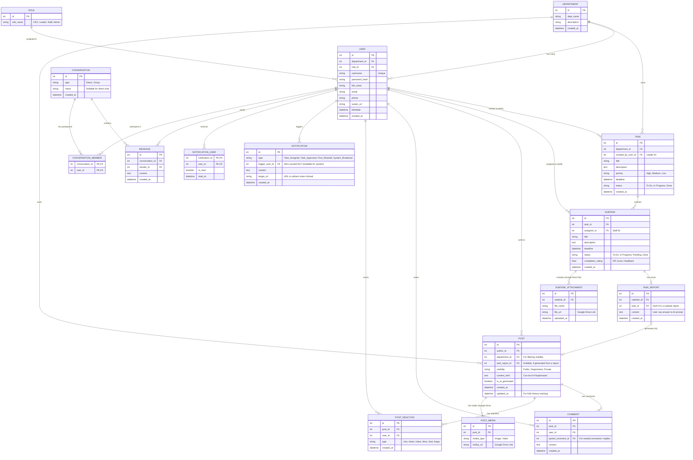

# TÀI LIỆU PHÂN TÍCH THIẾT KẾ KỸ THUẬT HỆ THỐNG RELIOO

Tài liệu này tập trung vào phân tích thiết kế chi tiết kiến trúc phần mềm, cấu trúc dữ liệu và các công nghệ sử dụng trong dự án mạng xã hội doanh nghiệp Relioo. Thiết kế này được tùy chỉnh để tuân thủ tuyệt đối các yêu cầu của Giảng viên và tối ưu hóa từ bản nháp ERD cũ của nhóm.

---

## 1. KIẾN TRÚC HỆ THỐNG & TECH STACK (CÔNG NGHỆ BẮT BUỘC)

Hệ thống được xây dựng bám sát 100% vào yêu cầu của môn học, đồng thời tích hợp các giải pháp hiện đại cho Backend.

**1.1. Frontend (Giao diện người dùng):**
- **Core:** HTML5, CSS3, JavaScript (Vanilla JS & jQuery).
- **UI Framework:** **Bootstrap 5** (Sử dụng Grid system, Flexbox, Cards, Modals để đảm bảo Responsive).
- **Thư viện Data Visualization:** **Chart.js** (Dùng để vẽ biểu đồ Tải trọng nhân sự, Hiệu suất phòng ban cho Master Dashboard của CEO).
- **Thư viện phụ trợ:** 
  - `Sortable.js` (Thao tác Kéo & Thả - Drag and Drop cho Kanban Board).
  - `SweetAlert2` / `Toastr` (Thông báo UI đẹp mắt thay vì dùng `alert` mặc định).
- **Giao tiếp Dữ liệu:** Sử dụng AJAX (jQuery `$.ajax` hoặc Fetch API) để truyền tải dữ liệu theo chuẩn JSON định tuyến chuẩn RESTful.

**1.2. Backend (Xử lý máy chủ):**
- **Ngôn ngữ:** **PHP 8+ (PHP thuần không dùng Framework như Laravel/CodeIgniter)**.
- **Kiến trúc:** **OOP + MVC** (Hướng đối tượng + Model-View-Controller).
  - Lớp `Controller`: Nhận yêu cầu từ AJAX, kiểm tra quyền hạn, gọi đến Model.
  - Lớp `Model`: Chứa các phương thức xử lý CSDL thao tác PDO hoặc MySQLi (Chuẩn Hướng Đối Tượng). Chuyển hóa dữ liệu về JSON (thông qua `json_encode`).
- **Webservice / API:** Toàn bộ dữ liệu trao đổi giữa các trang (Newsfeed, Kanban, Chart) đều qua API tự viết mức cơ bản phục vụ cho luồng AJAX.

**1.3. Cơ Sở Dữ Liệu (Database):**
- **MySQL / MariaDB** (Thông qua phần mềm XAMPP).

**1.4. External APIs (Dịch vụ bên thứ ba):**
- **AI Service:** **LLaMA 3 API (Meta)** thông qua dịch vụ trung gian Groq Cloud API hoặc OpenRouter API để đảm bảo tốc độ Response nhanh, không tốn tài nguyên máy tính cá nhân.
- **Media Storage Service:** **Google Drive API**. Cho phép người dùng upload hình ảnh/file minh chứng, code PHP chuyển nó lên Drive và lưu trữ `File ID / URL` về Database thay vì lưu file vật lý trên XAMPP local.

**1.5. Môi trường Mạng ảo (Mạng LAN):**
- **Tailscale:** 5 thành viên kết nối chung vào 1 IP ảo, sử dụng 1 máy tính làm Host Database và XAMPP Server chính để làm việc tập trung.

---

## 2. PHÂN TÍCH THIẾT KẾ CƠ SỞ DỮ LIỆU (DATABASE ERD)

Dựa trên hình ảnh sơ đồ ERD lúc đầu của nhóm gửi, tôi nhận thấy có nhiều điểm **chưa phân chuẩn** và **dư thừa dữ liệu** (Ví dụ: Tách rời bảng `USER` và `PROFILE` trong khi nó là một; Hay bảng `TASK` chứa `subtask_id` bị ngược chiều ràng buộc khóa ngoại). 

Dưới đây là một ERD mới, đã được chuẩn hóa lại toàn diện, tinh gọn, chặt chẽ và phục vụ đúng mọi luồng hệ thống ở hiện tại:



### Tại sao lại chuẩn hóa cấu trúc này?
1. **Giải quyết Mâu thuẫn cũ:** Gộp `PROFILE` và `USER` làm 1 bảng duy nhất giúp truy vấn Join dễ dàng hơn. Bỏ `TASK_ASSIGNMENTS` vòng vèo, trực tiếp gán `assignee_id` vào `SUBTASK` (chính xác với quy tắc 1 subtask = 1 nhân viên).
2. **Khóa ngoại Phòng ban (Department Visibility):** Các bảng chủ chốt như `USER`, `TASK` và `POST` đều mang `department_id`. Bằng cách này khi Trưởng phòng/Nhân viên làm việc, MySQL chỉ việc `WHERE department_id = X` là đã lọc xong, còn CEO thì bỏ `WHERE` ra.
3. **AI Pipeline & Media:** `TASK_REPORT` ghi nhận dữ liệu nhân viên nộp, bảng `POST` lưu trữ thành phẩm bài AI kèm cờ `is_ai_generated`. Mọi file đính kèm được xuất ra một bảng rẽ nhánh tên `SUBTASK_ATTACHMENT` và `POST_MEDIA` để Google Drive Link được lưu giữ ở mức vô hạn số lượng thay vì bị giới hạn 1 cột (như thiết kế cũ).
4. **Chat Box chuẩn hóa:** Có bảng `CONVERSATION` -> `CONVERSATION_MEMBER` -> `MESSAGE`.

---

## 3. PHÂN TÍCH KIẾN TRÚC THƯ MỤC CỐT LÕI (MVC OOP)

Dự án sẽ tuân thủ nghiêm ngặt mô hình MVC. Các file đóng gói gọn gàng:

```text
/Nhom9-WebDev-EnterpriseSocialNetwork-Project
├── /config
│   ├── database.php (PDO / MySQLi class kết nối Tailscale IP)
│   ├── gdrive.php   (Cấu hình Authentication Google Drive API)
│   └── llm_api.php  (Chứa Token cấu hình gọi LLaMA API qua OpenRouter/Groq)
├── /controllers
│   ├── AuthController.php
│   ├── PostController.php
│   ├── TaskController.php
│   └── NotificationController.php
├── /models
│   ├── User.php
│   ├── Post.php
│   ├── Task.php
│   └── DriveStorage.php
├── /views
│   ├── /layouts (header.php, footer.php, sidebar.php)
│   ├── /social  (newsfeed.php, profile.php)
│   ├── /kanban  (board.php)
│   ├── /admin   (master_dashboard.php, users_management.php)
├── /public
│   ├── /css (style.css, bootstrap.min.css)
│   ├── /js  (main.js, ajax_handlers.js, chart_config.js)
│   └── /assets
└── index.php (Front Controller Pattern - Điều hướng định tuyến)
```
